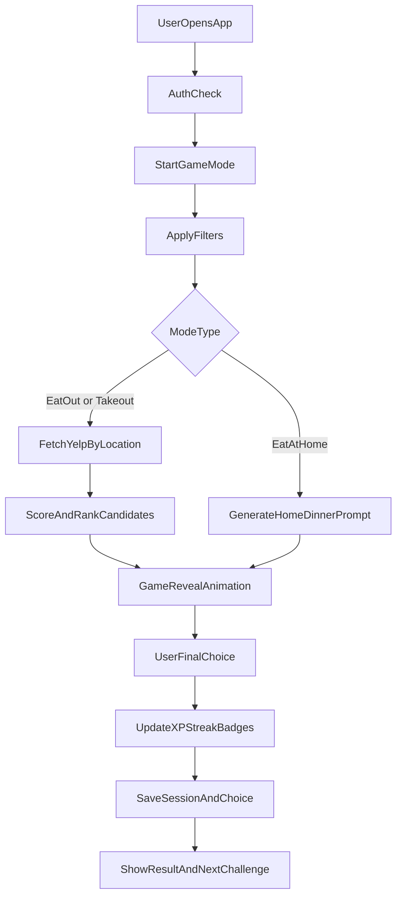

# Dinner Game MVP Plan

## Goals

- Create a fun, fast nightly decision flow for couples: `Eat at Home`, `Takeout`, or `Eat Out`.
- Provide location-based recommendations with Yelp data (reviews, cuisine, pricing, distance).
- Add practical filters (e.g., no meat, chicken, cuisine type, price) without hurting game feel.
- Include account-based rewards (streaks, XP, badges) to drive repeat use.

## Recommended Stack

- Frontend + backend app: Next.js (App Router) + TypeScript.
- UI: Tailwind CSS + component primitives.
- Auth + database: Supabase (email auth + Postgres).
- External API (MVP): Yelp Fusion API.
- Maps/geocoding: browser geolocation + fallback ZIP/city input.

## MVP Feature Set

- **Game flow**
  - Start screen with 3 modes: `Eat at Home`, `Takeout`, `Eat Out`.
  - “Spin/Draw” interaction that feels game-like (animated reveal + short suspense).
  - Optional “reroll” with small XP penalty to keep stakes fun.
- **Recommendations**
  - `Eat Out` and `Takeout`: query Yelp by location + filters.
  - Show top candidate cards: name, rating, price, categories, distance, review snippet.
  - `Takeout` in MVP uses Yelp restaurants tagged for delivery/takeout and UX placeholders for DoorDash/Uber Eats links.
  - `Eat at Home`: generate cuisine-style at-home prompts (e.g., “Taco Night”, “Pasta Night”), with quick ingredient-level tags.
- **Filters**
  - Dietary/protein toggles: no meat, chicken, beef, seafood, vegetarian.
  - Cuisine selector, price range, max distance, minimum rating.
  - Persist user defaults per account.
- **Rewards**
  - Daily streak for making a final dinner decision.
  - XP for actions: deciding without reroll, trying new cuisine, completing streak milestones.
  - Badge examples: `Decider 7`, `Cuisine Explorer`, `No-Argument Week`.

## Data Model (Initial)

- `users`: profile basics + preference defaults.
- `sessions`: each game session metadata (date, mode, location used).
- `choices`: final selected option + source (`yelp` or `home_prompt`) + attributes.
- `rewards_events`: XP events with reason + points.
- `user_badges`: unlocked badges + timestamps.

## System Flow

## API & Integration Notes

- Use a server-side API route for Yelp calls so API keys are never exposed client-side.
- Normalize Yelp response into app-specific DTOs (`name`, `rating`, `price`, `categories`, `distance`, `reviewText`).
- Add caching for repeated nearby queries to reduce latency and quota pressure.
- Keep `Takeout` provider integration abstracted so DoorDash/Uber Eats APIs can be added in phase 2.

## Build Phases

1. **Foundation**: scaffold app, auth, DB schema, base UI shell.
2. **Game + discovery**: mode chooser, animation reveal, Yelp-backed recommendations.
3. **Filters + persistence**: full filter UX, profile defaults, query mapping.
4. **Rewards loop**: XP/streak/badges + history page.
5. **Polish**: responsive UX, empty states, loading skeletons, error handling.

## Initial File/Module Blueprint

- [C:/Users/CaitlinGarrison/OneDrive - Catalyst Housing Group/Catalyst/Desktop/Cursor_WhatsForDinner/app/page.tsx](C:/Users/CaitlinGarrison/OneDrive%20-%20Catalyst%20Housing%20Group/Catalyst/Desktop/Cursor_WhatsForDinner/app/page.tsx) - game landing + mode selection.
- [C:/Users/CaitlinGarrison/OneDrive - Catalyst Housing Group/Catalyst/Desktop/Cursor_WhatsForDinner/app/api/recommendations/route.ts](C:/Users/CaitlinGarrison/OneDrive%20-%20Catalyst%20Housing%20Group/Catalyst/Desktop/Cursor_WhatsForDinner/app/api/recommendations/route.ts) - Yelp fetch + filter mapping.
- [C:/Users/CaitlinGarrison/OneDrive - Catalyst Housing Group/Catalyst/Desktop/Cursor_WhatsForDinner/lib/rewards.ts](C:/Users/CaitlinGarrison/OneDrive%20-%20Catalyst%20Housing%20Group/Catalyst/Desktop/Cursor_WhatsForDinner/lib/rewards.ts) - XP/streak/badge rules.
- [C:/Users/CaitlinGarrison/OneDrive - Catalyst Housing Group/Catalyst/Desktop/Cursor_WhatsForDinner/components/GameReveal.tsx](C:/Users/CaitlinGarrison/OneDrive%20-%20Catalyst%20Housing%20Group/Catalyst/Desktop/Cursor_WhatsForDinner/components/GameReveal.tsx) - spin/reveal interaction.
- [C:/Users/CaitlinGarrison/OneDrive - Catalyst Housing Group/Catalyst/Desktop/Cursor_WhatsForDinner/components/FilterPanel.tsx](C:/Users/CaitlinGarrison/OneDrive%20-%20Catalyst%20Housing%20Group/Catalyst/Desktop/Cursor_WhatsForDinner/components/FilterPanel.tsx) - dietary/protein/cuisine/price controls.

## Success Criteria (MVP)

- User can sign up, set filters, and complete a dinner decision in under 60 seconds.
- `Eat Out` and `Takeout` recommendations are location-aware and include Yelp rating/price/cuisine context.
- Rewards progress updates immediately after each finalized decision.
- Returning user sees streak continuity and recent history.

